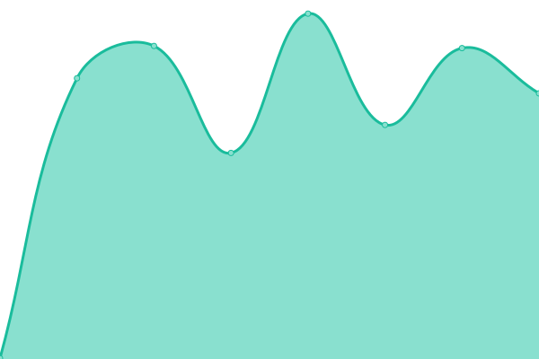
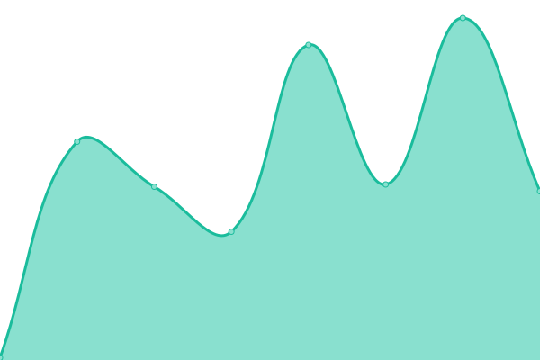
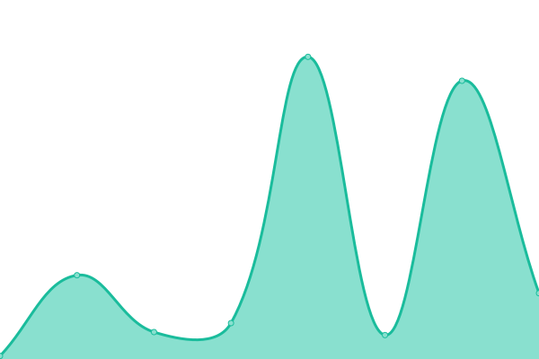

# [📈 Live Status](https://dreamalligator.github.io/monitoring): <!--live status--> **🟩 All systems operational**

This repository contains the open-source uptime monitor and status page for [Tommy](https://dreamalligator.github.io/monitoring), powered by [Upptime](https://github.com/upptime/upptime).

With [Upptime](https://upptime.js.org), you can get your own unlimited and free uptime monitor and status page, powered entirely by a GitHub repository. We use [Issues](https://github.com/dreamalligator/monitoring/issues) as incident reports, [Actions](https://github.com/dreamalligator/monitoring/actions) as uptime monitors, and [Pages](https://dreamalligator.github.io/monitoring) for the status page.

<!--start: status pages-->
<!-- This summary is generated by Upptime (https://github.com/upptime/upptime) -->
<!-- Do not edit this manually, your changes will be overwritten -->
<!-- prettier-ignore -->
| URL | Status | History | Response Time | Uptime |
| --- | ------ | ------- | ------------- | ------ |
|  [Black Forest Botanics](https://blackforestbotanics.com/) | 🟩 Up | [black-forest-botanics.yml](https://github.com/dreamalligator/monitoring/commits/HEAD/history/black-forest-botanics.yml) | 

 533ms
     
 | 

<a href="https://dreamalligator.github.io/monitoring/history/black-forest-botanics">100.00%</a>
    

|  [Vondrák](https://dreamalligator.github.io/vondrak/) | 🟩 Up | [vondrak.yml](https://github.com/dreamalligator/monitoring/commits/HEAD/history/vondrak.yml) | 

 95ms
     
 | 

<a href="https://dreamalligator.github.io/monitoring/history/vondrak">100.00%</a>
    

|  [CV](https://dreamalligator.github.io/cv/) | 🟩 Up | [cv.yml](https://github.com/dreamalligator/monitoring/commits/HEAD/history/cv.yml) | 

 36ms
     
 | 

<a href="https://dreamalligator.github.io/monitoring/history/cv">100.00%</a>
    

<!--end: status pages-->

[**Visit our status website →**](https://dreamalligator.github.io/monitoring)

## 📄 License

- Powered by: [Upptime](https://github.com/upptime/upptime)
- Code: [MIT](./LICENSE) © [Anand Chowdhary](https://anandchowdhary.com), supported by [Pabio](https://pabio.com)
- Data in the `./history` directory: [Open Database License](https://opendatacommons.org/licenses/odbl/1-0/)
